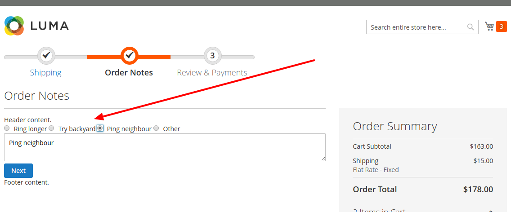
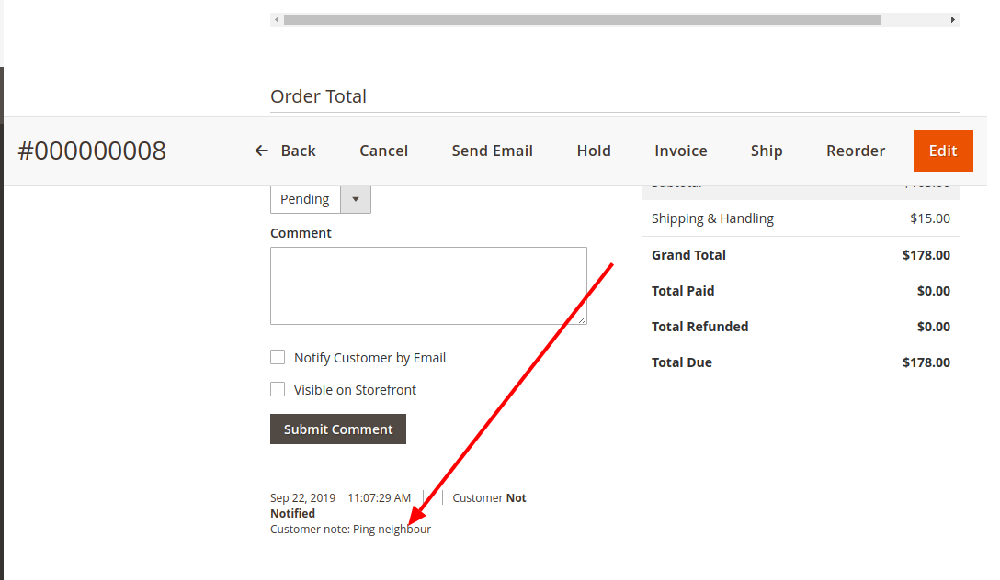
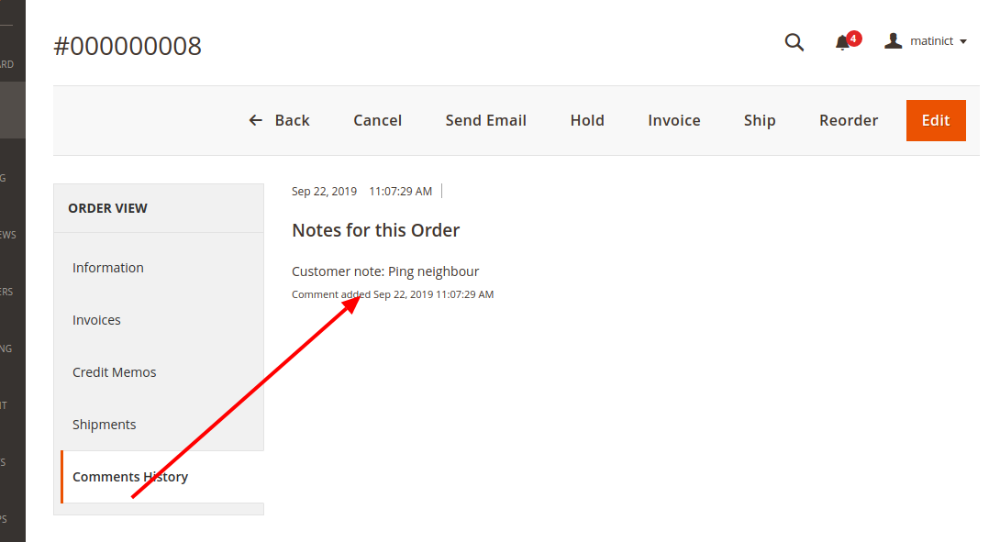

# Magento2x OrderNotes

This module is used as a OrderNotes for Magento 2 extensions.
we have built a small, but functional, order notes module. This allowed us to
familiarize ourselves with an important aspect of customizing the checkout experience. The gist
of this lies in understanding the checkout_index_index layout handle, the JavaScript
window.checkoutConfig object, and the uiComponent.


## Goal

- Customizing & Passing data Checkout Experiences
- Adding order notes to the checkout
- Learn Magento 2 Certified Professional Developer exam topics "Customizing the Checkout Process 13%"

## 1. Install & upgrade  OrderNotes


#### 1.1 Copy and paste

If you don't want to install via composer, you can use this way.

- Download [the latest version here](https://github.com/bdcrops/module-ordernotes/archive/master.zip)
- Extract `master.zip` file to `app/code/BDC/OrderNotes` ; You should create a folder path `app/code/BDC/OrderNotes` if not exist.
- Go to Magento root folder and run upgrade command line to install `BDC_OrderNotes`:

```
php bin/magento setup:upgrade
php bin/magento setup:static-content:deploy
```


#### 1.2 Install via composer

We recommend you to install BDC_OrderNotes module via composer. It is easy to install, update and maintaince.Run the following command in Magento 2 root folder.

```
composer config repositories.module-ordernotes git
https://github.com/bdcrops/module-ordernotes.git

composer require bdcrops/module-ordernotes:~1.0.0
php bin/magento setup:upgrade
php bin/magento setup:static-content:deploy
```

#### 1.3 Upgrade    

```
composer update bdcrops/module-ordernotes
php bin/magento setup:upgrade
php bin/magento setup:static-content:deploy
```

Run compile if your store in Product mode:

```
php bin/magento setup:di:compile
```

## 2. Magento 2 Module "OrderNotes" Step By Step Tutorial

- Create app/code/BDC/OrderNotes/registration.php
- Create app/code/BDC/OrderNotes/etc/module.xml
- Create app/code/BDC/OrderNotes/etc/frontend/routes.xml
- Create app/code/BDC/OrderNotes/Controller/Index.php
- Create app/code/BDC/OrderNotes/Controller/Index/Process.php
- Create app/code/BDC/OrderNotes/Model/ConfigProvider.php
- Create app/code/BDC/OrderNotes/Setup/InstallSchema.php
- Create app/code/BDC/OrderNotes/etc/frontend/di.xml
- Create app/code/BDC/OrderNotes/etc/webapi_rest/events.xml
- Create app/code/BDC/OrderNotes/Observer/SaveOrderNotesToOrder.php
- Create app/code/BDC/OrderNotes/view/frontend/layout/checkout_index_index.xml
- Create app/code/BDC/OrderNotes/view/frontend/web/js/view/order-notes.js
- Create app/code/BDC/OrderNotes/view/frontend/web/template/order/notes.html







## 3. FAQ

## Ref
